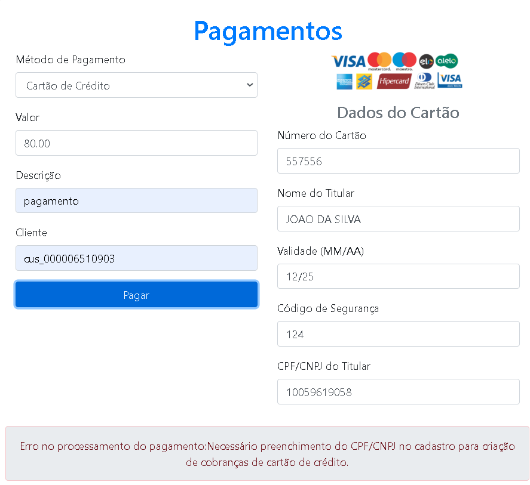

<!DOCTYPE html>
<html lang="pt">
<head>
  <meta charset="UTF-8">
  <meta name="viewport" content="width=device-width, initial-scale=1">
  <title>💳 Aplicação de Pagamento</title>
  
</head>
<body>

  <h1>💳 Aplicação de Pagamento</h1>
  

    
    
    
  

  

    Uma aplicação completa para processar pagamentos via Pix, cartão de crédito e boleto, com registro de transações e logs para auditoria.
  

  
  

  <h2>🚀 Começando</h2>

  <h3>Pré-requisitos</h3>
  <ul>
    <li>Node.js (v14 ou superior)</li>
    <li>npm (v6 ou superior)</li>
    <li>MySQL (ou banco compatível)</li>
  </ul>

  <h3>Instalação</h3>
  <ol>
    <li>
      <strong>Clone o repositório</strong>
      <pre><code>git clone https://github.com/diegoccx/projeto_pagamento.git
cd projeto_pagamento</code></pre>
    </li>
    <li>
      <strong>Instale as dependências</strong>
      <pre><code>npm install</code></pre>
    </li>
    <li>
      <strong>Configure o banco de dados</strong>
      
Crie um banco MySQL e execute os scripts SQL abaixo:

      <h4>Tabela pagamentos</h4>
      <pre><code>CREATE TABLE pagamentos (
    id INT PRIMARY KEY AUTO_INCREMENT,
    valor DECIMAL(10, 2) NOT NULL,
    metodo_pagamento ENUM('pix', 'cartao_credito', 'boleto') NOT NULL,
    status ENUM('pendente', 'concluido', 'falhou') NOT NULL,
    data_criacao TIMESTAMP DEFAULT CURRENT_TIMESTAMP,
    data_conclusao TIMESTAMP,
    descricao VARCHAR(255)
);</code></pre>
      <h4>Tabela logs</h4>
      <pre><code>CREATE TABLE logs (
    id INT PRIMARY KEY AUTO_INCREMENT,
    tipo_log ENUM('info', 'erro', 'alerta') NOT NULL,
    mensagem TEXT NOT NULL,
    data_criacao TIMESTAMP DEFAULT CURRENT_TIMESTAMP
);</code></pre>
      
    </li>
    <li>
      <strong>▶️ Execução</strong>
      
Inicie o servidor:

      <pre><code>npm start</code></pre>
      
Acesse: <a href="http://localhost:3000" target="_blank">http://localhost:3000</a>

    </li>
  </ol>

  <h2>💻 Funcionalidades</h2>
  <h3>Fluxos de Pagamento</h3>
  <ol>
    <li>
      <strong>Pix</strong>
      <ul>
        <li>Gera código Pix/QR Code</li>
        <li>Registra pagamento como pendente</li>
        <li>Atualiza para concluído após confirmação</li>
      </ul>
    </li>
    <li>
      <strong>Cartão de Crédito</strong>
      <ul>
        <li>Valida dados do cartão</li>
        <li>Processa cobrança</li>
        <li>Atualiza status conforme transação</li>
      </ul>
      
    </li>
    <li>
      <strong>Boleto</strong>
      <ul>
        <li>Gera código de barras</li>
        <li>Mantém status pendente</li>
        <li>Confirma após compensação</li>
      </ul>
    </li>
  </ol>

  <h2>📡 Exemplo de Uso da API</h2>
  <h3>Requisição:</h3>
  <pre><code>POST /api/pagamentos
{
    "valor": 150.00,
    "metodo_pagamento": "pix",
    "descricao": "Pagamento por produto A"
}</code></pre>
  <h3>Resposta:</h3>
  <pre><code>{
    "id": 12345,
    "status": "pendente",
    "metodo_pagamento": "pix",
    "valor": 150.00,
    "data_criacao": "2025-02-13T14:00:00Z"
}</code></pre>

  <h2>🧪 Testes e Cobertura</h2>
  
Execute os testes:

  <pre><code>npm test</code></pre>
  
Verifique a cobertura (80%):

  <pre><code>npm run coverage</code></pre>
  

  <h2>📊 Dados Armazenados</h2>
  <h3>Exemplo de Registros</h3>
  <h4>Tabela pagamentos:</h4>
  
  <h4>Tabela logs:</h4>
  

  <h2>📄 Licença</h2>
  
Este projeto está licenciado sob a MIT License.

  
Desenvolvido com ❤️ por Diego

  
<a href="#">Reportar Bug</a> | <a href="#">Solicitar Feature</a>

  

  <h2>Principais Melhorias</h2>
  <ol>
    <li>
      <strong>Organização Visual</strong>
      <ul>
        <li>Divisão clara em seções com ícones e badges</li>
        <li>Hierarquia de títulos melhor definida</li>
      </ul>
    </li>
    <li>
      <strong>Fluxo Lógico</strong>
      <ul>
        <li>Sequência natural: instalação → configuração → uso → detalhes técnicos</li>
        <li>Separação clara entre frontend e backend</li>
      </ul>
    </li>
    <li>
      <strong>Formatação de Código</strong>
      <ul>
        <li>Syntax highlighting em blocos de código</li>
        <li>Identação consistente</li>
        <li>Exemplos de API mais visíveis</li>
      </ul>
    </li>
    <li>
      <strong>Documentação Técnica</strong>
      <ul>
        <li>Detalhamento da estrutura do banco</li>
        <li>Exemplos práticos de registros</li>
        <li>Fluxos de pagamento passo-a-passo</li>
      </ul>
    </li>
    <li>
      <strong>Elementos Visuais</strong>
      <ul>
        <li>Imagens posicionadas estrategicamente</li>
        <li>Badges de status e licença</li>
        <li>Links interativos</li>
      </ul>
    </li>
    <li>
      <strong>Facilidade de Uso</strong>
      <ul>
        <li>Comandos copiáveis via terminal</li>
        <li>Seção de troubleshooting com capturas de erro</li>
        <li>Informações de contato claras</li>
      </ul>
    </li>
  </ol>

</body>
</html>
