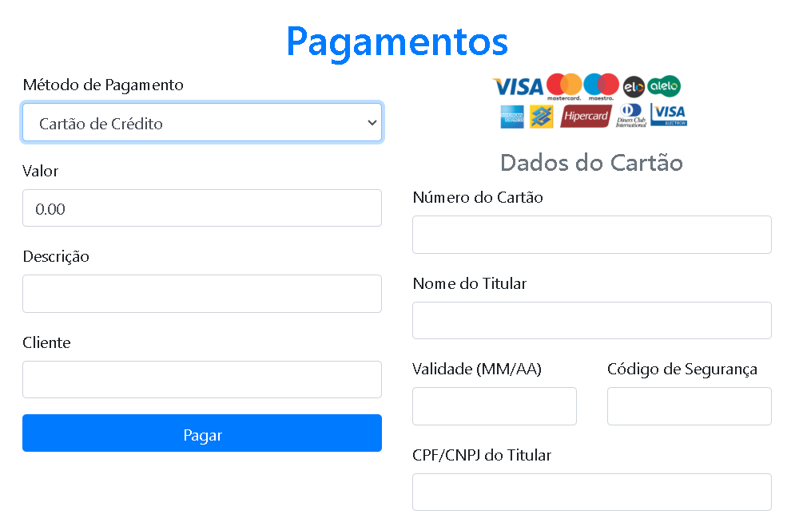
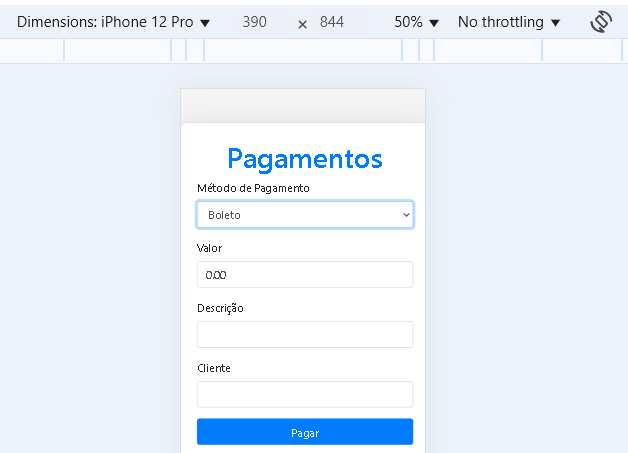
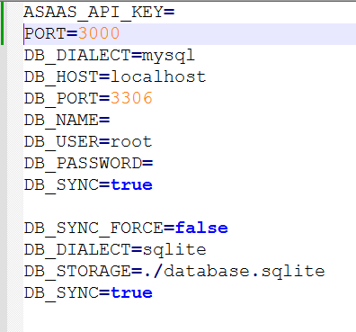
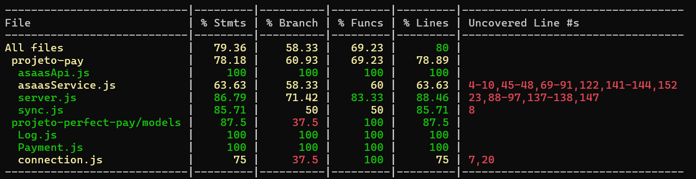
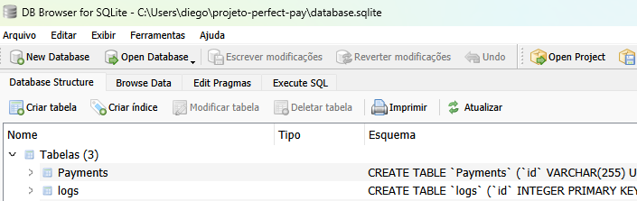
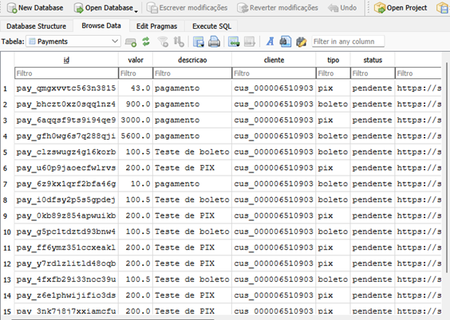
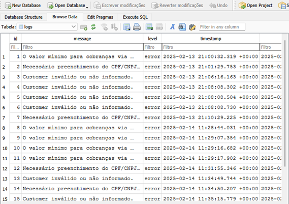

# 💳 Aplicação de Pagamento 

 


Solução completa para processar pagamentos via **Pix**, **Cartão de Crédito** e **Boleto**, com registro de transações e sistema de logs para auditoria.





  

 

  
  
# 1. Visão Geral
    
- A aplicação foi desenvolvida para oferecer uma solução completa para o processamento de pagamentos.
Principais características:
  - Processamento de diversos métodos de pagamento
  - Registro detalhado de transações e logs para auditoria
  - Interface responsiva e intuitiva
 

- A estrutura do projeto backend utilizando Node.js e Express para processamento de pagamentos via Asaas (um sistema de pagamento) com métodos como boleto, cartão de crédito e Pix. Vamos analisar em detalhes a estrutura de pastas e arquivos:

- Estrutura de Pastas e Arquivos
- models/

- connection.js: Arquivo responsável pela configuração da conexão com o banco de dados (como MySQL, PostgreSQL ou MongoDB). Ele provavelmente exporta um objeto ou função que estabelece a conexão com o banco, permitindo a persistência de dados.
Log.js: Modelo para registrar logs de erros ou atividades no sistema. O modelo define a estrutura de um "log", provavelmente incluindo campos como mensagem, nível de erro, e data. Ele também deve ter métodos para gravar esses registros no banco.
Payment.js: Modelo para registrar os pagamentos realizados. Este arquivo define a estrutura de dados relacionada aos pagamentos, como id, valor, descrição, cliente, status, tipo de pagamento (boleto, cartão, pix), etc. Ele é usado para gravar o status e as informações dos pagamentos realizados.
public/

- index.html: Arquivo HTML principal que serve como frontend para a aplicação. Embora o backend esteja sendo descrito, esse arquivo HTML pode fornecer uma interface básica, como um formulário para o usuário informar dados de pagamento ou visualizar informações de status.
test/

- pagamento.test.js: Arquivo de testes unitários ou de integração para verificar o correto funcionamento das rotas relacionadas a pagamentos. O teste provavelmente simula requisições HTTP para verificar se as funcionalidades de pagamento (boleto, cartão e Pix) estão funcionando conforme esperado, incluindo a validação de entradas e a resposta do servidor.
.env

- Arquivo que contém variáveis de ambiente, como chaves de API (no caso, a API Key do Asaas), configurações do banco de dados, porta do servidor, entre outras. O arquivo não é versionado (deve ser adicionado ao .gitignore) para garantir a segurança das credenciais e informações sensíveis.
asaasService.js

- Serviço que lida com a comunicação com a API do Asaas. Este arquivo contém funções específicas que interagem com a API do Asaas para criar pagamentos, consultar o status de transações, etc. Ele utiliza o cliente HTTP Axios para fazer as requisições para o Asaas e retornar os dados para o servidor.
asaasApi.js

- Arquivo que configura a instância do Axios com a URL da API do Asaas e a chave de acesso. Ele centraliza a configuração de autenticação e define os cabeçalhos (como o access_token) que serão usados nas requisições à API do Asaas.
server.js

- Arquivo principal do servidor. Aqui é onde o servidor Express é configurado e as rotas (como /api/pagamento/boleto, /api/pagamento/cartao e /api/pagamento/pix) são registradas. Ele também importa o serviço do Asaas e os modelos para persistir dados no banco. Além disso, o arquivo contém as configurações do servidor, como o uso de middlewares (body-parser), validações de dados e gerenciamento de erros.
sync.js

- Responsável por sincronizar ou configurar a inicialização do banco de dados, como criar tabelas, gerar registros iniciais ou realizar algum tipo de preparação para que o banco de dados esteja pronto para uso. Pode incluir chamadas para sincronizar os modelos com o banco de dados ou até mesmo preencher com dados iniciais.
Explicação do Fluxo Principal do Projeto
Configuração da API do Asaas:

- O arquivo asaasApi.js cria a instância do Axios configurando a URL base da API do Asaas e incluindo a chave de autenticação (access_token) extraída do .env.
O asaasService.js contém as funções que lidam diretamente com a API do Asaas, como criar pagamentos para cada método (boleto, cartão de crédito, Pix).
Roteamento e Processamento de Pagamentos (em server.js):

- As rotas de pagamento são configuradas no Express. As rotas são como "endpoints" da API onde o servidor vai responder às requisições HTTP.
- POST /api/pagamento/boleto: Recebe os dados do pagamento via boleto, valida as informações de entrada e chama o asaasService.criarPagamentoBoleto() para interagir com a API do Asaas. O pagamento é registrado no banco (modelo Payment) e, se for bem-sucedido, a URL do boleto é retornada.
- POST /api/pagamento/cartao: Semelhante à rota do boleto, mas para o processamento de pagamentos via cartão de crédito. O cartão é validado (dados do cartão e CPF/CNPJ do titular), e o pagamento é registrado no banco.
- POST /api/pagamento/pix: Semelhante ao boleto, mas para pagamentos via Pix. A URL do boleto pode ser gerada em alguns casos, como fallback para pagamento via QR Code.
Validação e Salvamento de Dados:

- O uso de express-validator é crucial para garantir que os dados recebidos nas requisições estejam corretos (ex: valor maior que zero, campos obrigatórios preenchidos). Caso algum dado seja inválido, o servidor retorna uma resposta de erro.
- Os logs de erro são salvos usando o modelo Log.js e podem ser consultados posteriormente.
- Testes (em test/pagamento.test.js):

- O arquivo de teste provavelmente simula as requisições das rotas de pagamento e verifica se as respostas estão corretas, se os dados são salvos corretamente no banco e se os erros são tratados adequadamente.
- Resumo da Arquitetura do Sistema
- Backend em Node.js com Express, configurando rotas RESTful para processar pagamentos.
- Integração com a API do Asaas para pagamento via boleto, cartão de crédito e Pix.
- Persistência dos dados utilizando modelos do Sequelize (provavelmente) para armazenar informações sobre os pagamentos e logs de erros.
- Validação de dados nas requisições HTTP usando o express-validator.
- Testes automatizados para garantir a funcionalidade e estabilidade do sistema.
- Tratamento de erros e armazenamento de logs.
- Esse fluxo permite que a aplicação realize transações financeiras com diferentes métodos de pagamento e tenha um sistema robusto de validação e persistência de dados.  

  

  

 

### Pré-requisitos
- Node.js v14+
- npm v6+
- MySQL ou compatível

## ⚙️ Instalação

1. Clone o repositório:
```
git clone https://github.com/diegoccx/projeto_pagamento.git

cd projeto_pagamento
```
# 3.2 Instalando Dependências:
  <code><pre> $ npm install
   </code></pre>
   
 
#   3.2.1 Configuração do Arquivo .env


    
	
- Para testar a integração com a API do Asaas, crie uma conta no Asaas Sandbox:
      • Acesse: https://sandbox.asaas.com/ e registre-se.
      • Após o cadastro, vá até "Configuração de Conta -> Integrações" para obter sua API Key de Sandbox.

Para verificar a cobertura de código (meta de 80% ou mais):
  $ npm run coverage


   
  

3.3 Configurando o Banco de Dados:
  • Crie um banco de dados MySQL.
  • Execute os scripts SQL abaixo para criar as tabelas essenciais.




##Tabela de Pagamentos:
```
  CREATE TABLE pagamentos (
    id INT PRIMARY KEY AUTO_INCREMENT,
    valor DECIMAL(10, 2) NOT NULL,
    metodo_pagamento ENUM('pix', 'cartao_credito', 'boleto') NOT NULL,
    status ENUM('pendente', 'concluido', 'falhou') NOT NULL,
    data_criacao TIMESTAMP DEFAULT CURRENT_TIMESTAMP,
    data_conclusao TIMESTAMP,
    descricao VARCHAR(255)
  );
  ```
  

##Tabela de Logs:
```
  CREATE TABLE logs (
    id INT PRIMARY KEY AUTO_INCREMENT,
    tipo_log ENUM('info', 'erro', 'alerta') NOT NULL,
    mensagem TEXT NOT NULL,
    data_criacao TIMESTAMP DEFAULT CURRENT_TIMESTAMP
  );
   ```


    
	  
  

 


 
   # 4. Execução da Aplicação
   
Para iniciar a aplicação:
  1. Inicie o servidor:
   ```
       $ npm start
	    ```
  2. Acesse a aplicação via navegador em:
   ```
       http://localhost:3000
    ```
  

 

  
 
    # 5. Funcionalidades e Fluxos de Pagamento
 
##Pix:
  - Gera código Pix/QR Code
  - Registra o pagamento com status "pendente"
  - Atualiza o status para "concluído" após confirmação

##Cartão de Crédito:
  - Valida os dados do cartão
  - Processa a cobrança
  - Atualiza o status conforme o resultado da transação
    (Consulte public/img/ERRO_CARTAO.png para exemplo de erro)

##Boleto:
  - Gera código de barras
  - Registra o pagamento com status "pendente"
  - Confirma o pagamento após compensação
   
  

 

  
  
   # 6. Exemplo de Uso da API
 <pre><code>
Requisição (HTTP POST):
  URL: /api/pagamentos
  Headers: Content-Type: application/json
  Body:
  {
  "billingType": "BOLETO",
  "customer": "cus_000006510903",
  "value": 140,
  "dueDate": "2025-03-03"
}

Resposta:
  {
  "object": "payment",
  "id": "pay_6ntu8so0bjerfuiz",
  "dateCreated": "2025-02-14",
  "customer": "cus_000006510903",
  "paymentLink": null,
  "value": 140,
  "netValue": 139.01,
  "originalValue": null,
  "interestValue": null,
  "description": null,
  "billingType": "BOLETO",
  "canBePaidAfterDueDate": true,
  "pixTransaction": null,
  "status": "PENDING",
  "dueDate": "2025-03-03",
  "originalDueDate": "2025-03-03",
  "paymentDate": null,
  "clientPaymentDate": null,
  "installmentNumber": null,
  "invoiceUrl": "https://sandbox.asaas.com/i/6ntu8so0bjerfuiz",
  "invoiceNumber": "07665783",
  "externalReference": null,
  "deleted": false,
  "anticipated": false,
  "anticipable": false,
  "creditDate": null,
  "estimatedCreditDate": null,
  "transactionReceiptUrl": null,
  "nossoNumero": "10615931",
  "bankSlipUrl": "https://sandbox.asaas.com/b/pdf/6ntu8so0bjerfuiz",
  "lastInvoiceViewedDate": null,
  "lastBankSlipViewedDate": null,
  "discount": {
    "value": 0,
    "limitDate": null,
    "dueDateLimitDays": 0,
    "type": "FIXED"
  },
  "fine": {
    "value": 0,
    "type": "FIXED"
  },
  "interest": {
    "value": 0,
    "type": "PERCENTAGE"
  },
  "postalService": false,
  "custody": null,
  "refunds": null
}
   
</code></pre>
  

 

 
  
# 7. Testes e Cobertura de Código


   
1. Para testar a aplicação, execute:
<pre><code>
 $ npm test
</code></pre>
2. Para verificar a cobertura de código (meta de 80% ou mais):
<pre><code>
  $ npm run coverage
</code></pre>
  

  

#8. Dados Armazenados
   
1. Exemplo de registros armazenados:

2. Tabela de Pagamentos:
  [Imagem: Registros de Pagamentos] (public/img/tabela_pagamentos.png)

3. Tabela de Logs:
  [Imagem: Registros de Logs] (public/img/tabela_logs.png)
 

 

  
  

  
 
 ##  10. Considerações
- Organização Visual:
- Seções bem definidas com ícones e badges
- Hierarquia clara de títulos para facilitar a navegação
- Fluxo Lógico e Técnica:
- Passo-a-passo detalhado desde a instalação até a execução
- Instruções específicas para configuração do ambiente e banco de dados
- Formatação de Código:
- Blocos de código com syntax highlighting
- Exemplos práticos e claros do uso da API
- Documentação Técnica:
- Detalhamento completo das funcionalidades e fluxos de pagamento
- Explicações didáticas para cada etapa do processo
- Elementos Visuais:
- Imagens, badges e links interativos para melhorar a experiência do usuário
- Design responsivo e acessível
- Facilidade de Uso:
- Comandos e instruções copiáveis para facilitar a execução
- Seção de troubleshooting com exemplos de erros comuns

 
  
 
    #11. Explicações Técnicas Adicionais#
    

  

- Integração com o Sandbox Asaas:
  - Para testar a integração com a API do Asaas, crie uma conta no Asaas Sandbox:
      • Acesse: https://sandbox.asaas.com/ e registre-se.
      • Após o cadastro, vá até "Configuração de Conta -> Integrações" para obter sua API Key de Sandbox.
  - A API Key é necessária para iniciar a integração e simular transações.
  - Consulte a documentação oficial do Asaas em:
      https://asaasv3.docs.apiary.io/#
    para mais detalhes sobre os endpoints e parâmetros.
   
 #12. TESTES E POSTMAN# 
1. Para testar essa aplicação com Cypress e Postman, vamos seguir dois caminhos: um para testes automatizados usando Cypress (para testes de front-end) e outro para testar a API diretamente no Postman.

2. Testes no Cypress
Primeiro, para usar o Cypress, instale as dependências necessárias:


<pre><code>
npm install cypress --save-dev
</code></pre>
3. Depois, crie a estrutura de pastas para os testes. Crie uma pasta cypress no diretório raiz do projeto, e dentro dela a pasta integration para os testes:

<pre><code>
project_root/
│
├── cypress/
│   └── integration/
│       └── pagamentos.spec.js
</code></pre>

4. Dentro do arquivo pagamentos.spec.js, crie os testes. A seguir está um exemplo de teste para criar um pagamento com boleto:
<pre><code>
cypress/integration/pagamentos.spec.js

describe('Teste de Pagamentos', () => {
  it('Deve criar pagamento de boleto', () => {
    cy.visit('/'); // Acessa a página inicial (index.html)

    cy.get('input[name="valor"]').type('140'); // Insere o valor
    cy.get('input[name="descricao"]').type('Pagamento de Teste Boleto'); // Insere a descrição
    cy.get('input[name="cliente"]').type('cus_000006510903'); // Insere o ID do cliente

    // Envia o formulário
    cy.get('form').submit();

    // Verifica a resposta da API
    cy.intercept('POST', '/api/pagamento/boleto').as('criarBoleto');
    cy.wait('@criarBoleto').its('response.statusCode').should('eq', 200); // Verifica se a resposta é 200

    // Valida se a URL do boleto foi retornada
    cy.get('.boletoUrl').should('contain', 'https://link.boletobancario.com'); // Verifica se a URL do boleto está na página
  });
});
</code></pre>
5. Passos para rodar o Cypress:
- No terminal, execute o seguinte comando para abrir a interface do Cypress:

<pre><code>
npx cypress open
</code></pre>
- Clique no teste pagamentos.spec.js para rodá-lo e acompanhar o resultado dos testes.

- Testes no Postman
Agora, para testar diretamente a API, siga os seguintes passos:

- Abrir o Postman:

- Se você ainda não tem o Postman, baixe e instale o Postman aqui.
Criar uma nova requisição POST para a rota de pagamento do boleto:

URL: http://localhost:3000/api/pagamento/boleto

Método: POST

Body: Selecione a opção raw e escolha o formato JSON. A seguir, cole o corpo da requisição:

<pre><code>
{
  "valor": 140,
  "descricao": "Pagamento de Teste Boleto",
  "cliente": "cus_000006510903"
}
</code></pre>
Adicionar Cabeçalhos:

No cabeçalho da requisição, adicione:
Content-Type: application/json
access_token: Insira a chave ASAAS_API_KEY do seu arquivo .env (caso esteja usando um token de acesso).
Testar a API:

Após configurar o body e os cabeçalhos, clique em Send.
O Postman deverá retornar uma resposta de sucesso com o status 200 OK e, se a requisição for bem-sucedida, o retorno incluirá a URL do boleto gerado.
Exemplo de resposta:

<pre><code>
{
  "mensagem": "Pagamento Boleto gerado com sucesso.",
  "pagamento": {
    "id": "pay_0001",
    "valor": 140,
    "descricao": "Pagamento de Teste Boleto",
    "cliente": "cus_000006510903",
    "tipo": "boleto",
    "status": "pendente",
    "boletoUrl": "https://link.boletobancario.com"
  },
  "boletoUrl": "https://link.boletobancario.com"
}
</code></pre>
Verificar a resposta:

Verifique no campo de resposta se o pagamento foi criado com sucesso e se o URL do boleto está correto.
Resumo do Passo a Passo para Postman:
Configurar a requisição:
<pre><code>
Método: POST
URL: http://localhost:3000/api/pagamento/boleto
Body (raw JSON):
json
Copiar
Editar
{
  "valor": 140,
  "descricao": "Pagamento de Teste Boleto",
  "cliente": "cus_000006510903"
}
</code></pre>
- Adicionar cabeçalhos:

- Content-Type: application/json
- access_token: Seu token de acesso (obtido via .env)
- Enviar a requisição e verificar se a URL do boleto foi gerada na resposta.

- Com essas etapas, você será capaz de testar tanto a API quanto o front-end da aplicação, utilizando Cypress para testar a interação do usuário e Postman para testar diretamente a API de pagamentos. 

